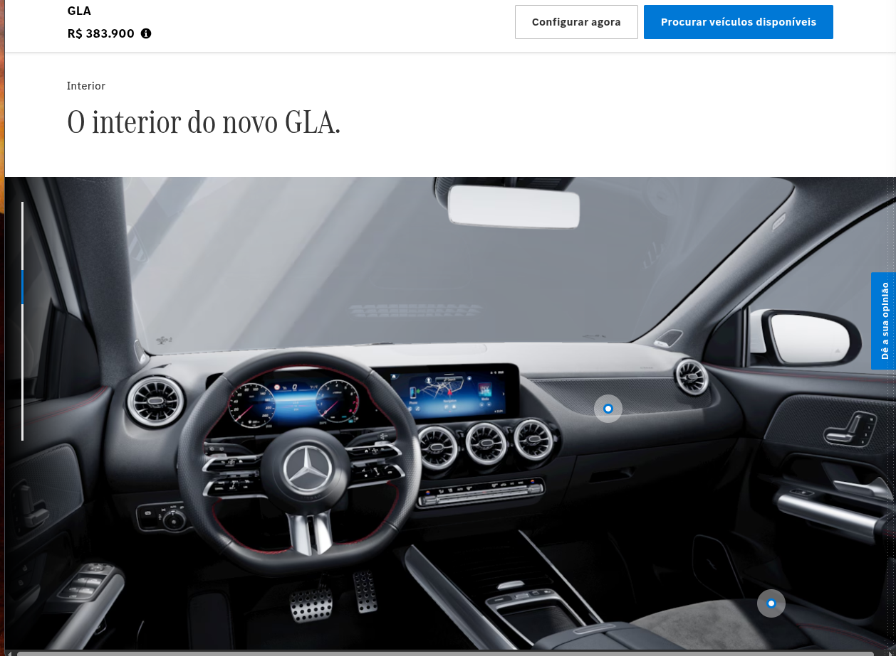
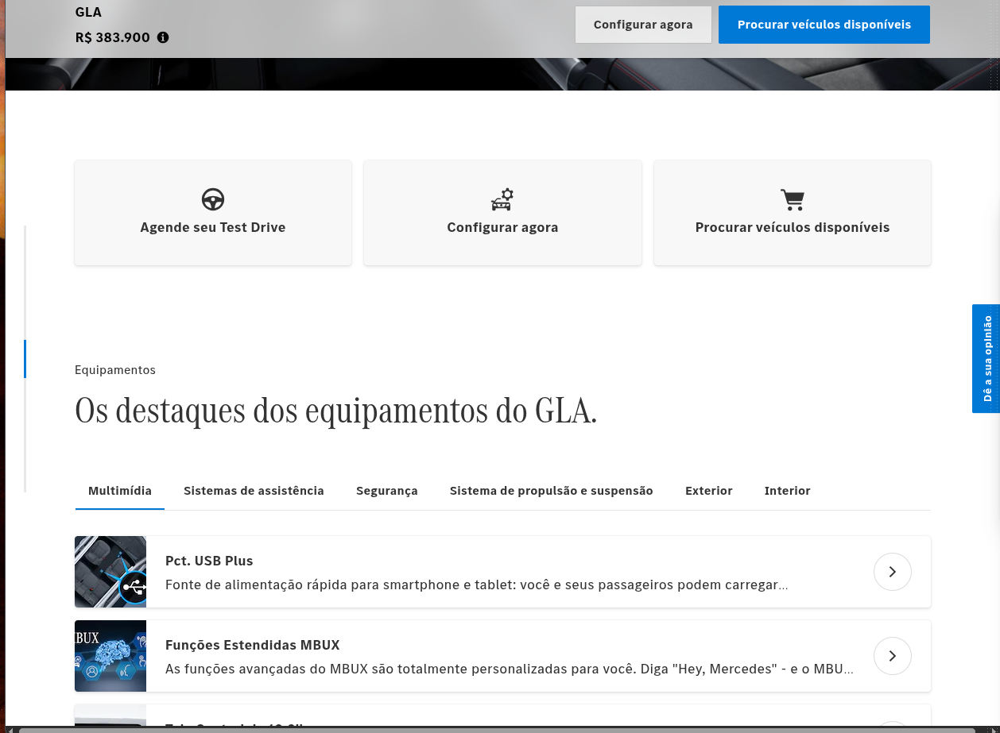
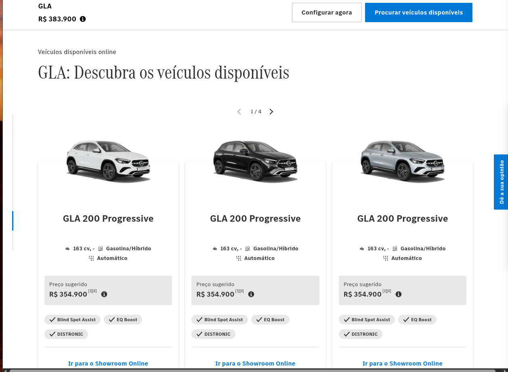
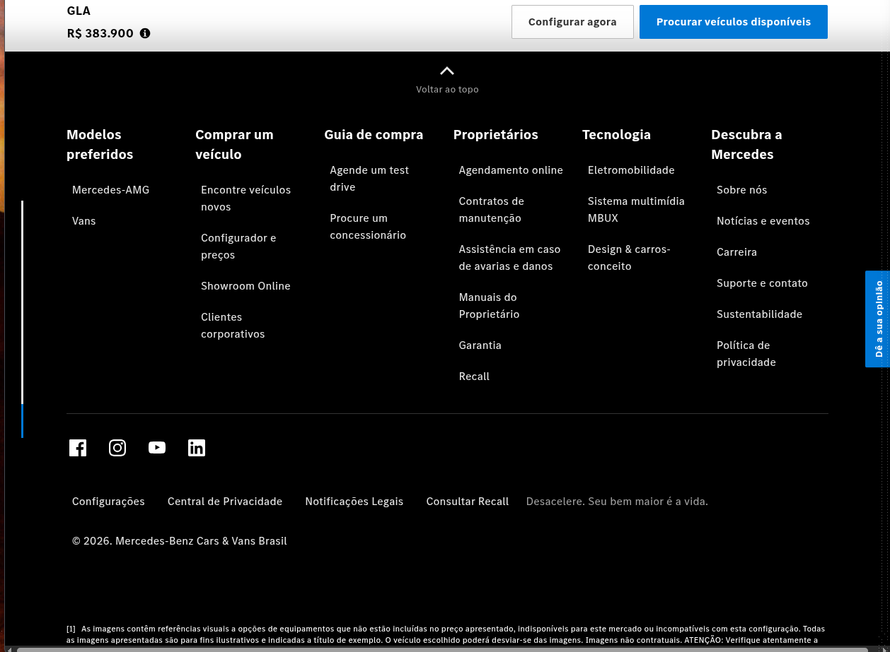

Atue como um Desenvolvedor Front-end Sênior, especialista em Astro e Tailwind CSS.

A partir de agora, crie os componentes de interface seguindo estritamente o Design System abaixo, focado em um visual premium e automotivo de luxo.

 1. Cores (Design Tokens)
Fundos: Predominância de Black (#000000), White (#FFFFFF) e uma escala de cinzas frios do Tailwind (ex: zinc-50 a zinc-900) para separar seções.

Cor de Destaque (Ações/Botões): Azul Azure (use blue-600 ou blue-700 do Tailwind).

Transparências: Use fundos escuros com opacidade para sobreposições (ex: bg-black/90, bg-black/40, bg-black/15).

 2. Geometria e Bordas (Luxo e Precisão)
Border Radius: Quase inexistente. Use APENAS cantos retos (rounded-none) ou um arredondamento mínimo de 2px (rounded-[2px] ou rounded-sm). Nunca use botões redondos (rounded-full).

Border Width: Bordas finas e elegantes. Use espessura de 1px (border) para divisórias e contornos de botões secundários, e no máximo 2px (border-2) para inputs em foco.

3. Tipografia
Família: Fonte Inter (sans-serif) para todo o site.

Pesos: Use apenas Regular (400) para textos corridos e descrições, e Bold (700) para títulos e chamadas de ação. Eventualmente Italic para detalhes técnicos.

Contraste de Texto: Títulos devem ser muito contrastantes (Branco puro no fundo preto, Preto puro no fundo branco). Textos de apoio devem usar cinzas (ex: text-zinc-400).

Fotos de referencia:

